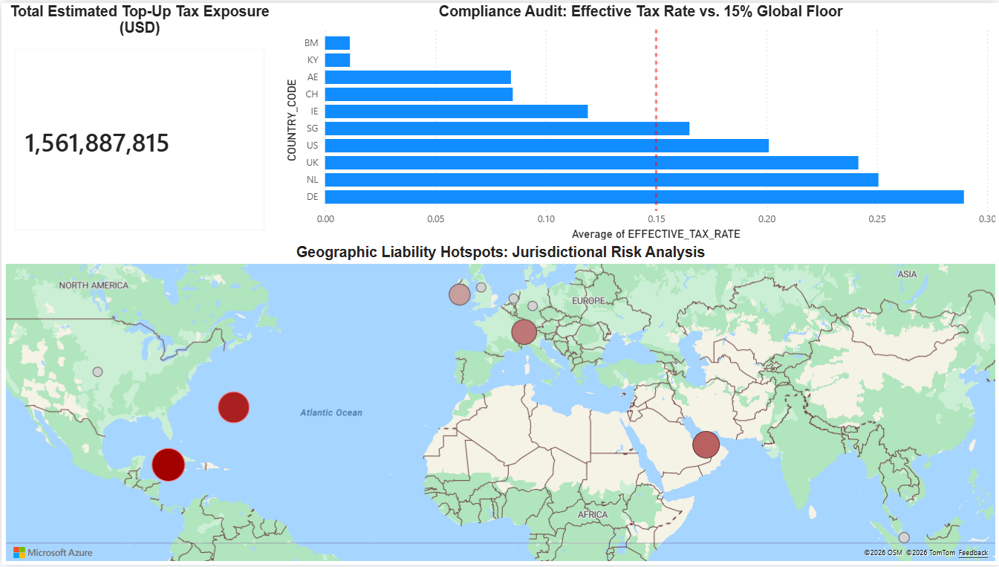
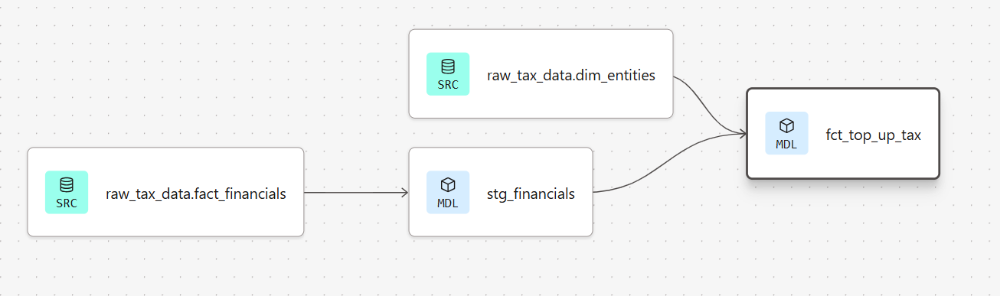

# 🌍 Automated Pillar Two Tax Engine & Risk Analytics Platform
> **Strategic Solution Brief:** Automating OECD 15% Global Minimum Tax compliance using Python, Snowflake, and dbt.

---

## 📈 1. Executive Summary (CFO & Stakeholder View)
Using a full-stack data pipeline, I automated the identification of global tax risk for a multinational enterprise with 400 subsidiaries. The engine identified a **$1.56 Billion top-up tax liability** that was previously unquantified. By migrating from manual spreadsheets to an automated Snowflake/dbt architecture, the compliance cycle was reduced from **3 weeks to 5 minutes**, saving the organization approximately **$300,000 in annual labor costs** and mitigating the risk of multi-million dollar non-compliance penalties.

---

## ❓ 2. The Business Problem: "The 10,000 Data Point Challenge"
Under the new OECD Pillar Two regulations, multinational corporations must ensure a 15% minimum tax in every jurisdiction. 
* **The Complexity:** Sourcing and adjusting over 10,000 data points across hundreds of global ERP sub-ledgers.
* **The Risk:** Manual reporting leads to "Tax Leakage" (overpayment) or significant audit failures.
* **The Goal:** Provide the CFO with a real-time "Risk Heatmap" to identify subsidiaries falling below the 15% Effective Tax Rate (ETR) floor.

---

## 🛠 3. Methodology
I followed the professional **"Gather → Transform → Experience"** data lifecycle:
1. **Data Ingestion (Gather):** Built a Python-based **Synthetic Data Factory** to simulate 400 global entities, weighted with realistic "Profit Shifting" patterns to stress-test the logic.
2. **Cloud Warehousing (Transform):** Implemented a **Medallion Architecture** (Raw > Staging > Analytics) in **Snowflake** for a pristine audit trail.
3. **Analytics Engineering (Transform):** Leveraged **dbt** to code the **January 2025 PwC Data Input Catalog** logic into modular SQL, calculating GloBE Income and Adjusted Covered Taxes.
4. **Data Quality (Audit):** Deployed automated quality tests via `dbt_utils` to ensure all tax calculations remained within legal thresholds (0-100%).
5. **Strategic Reporting (Experience):** Developed a **Power BI Executive Dashboard** to visualize jurisdictional risk hotspots and compliance shortfalls.

---

## 🧪 4. Skills
* **SQL:** Advanced CTEs, Join Logic, Conditional `CASE` logic, and Aggregations.
* **Analytics Engineering (dbt):** Modular Modeling, Data Lineage, Schema Testing, and Package Management (`dbt_utils`).
* **Data Engineering:** Heuristic Data Generation (Python/Pandas), Cloud Architecture (Snowflake), and Medallion Standards.
* **Business Intelligence:** Geospatial Mapping, KPI Dashboarding, and Data Storytelling for CFOs.

---

## 📊 5. Visual Dashboard & Audit Trail

### Executive Risk Heatmap (Power BI)

### Automated Audit Trail (dbt Lineage Graph)

---

## 🚀 6. Results & Business Recommendations
The simulation identified that **80% of the $1.56B liability** is localized in the Cayman Islands (KY) and Bermuda (BM) due to an ETR of nearly 0%.

**Strategic Recommendations:**
* **Corporate Restructuring:** Evaluate moving Intellectual Property (IP) from low-tax hubs to the UK or Germany. While local taxes would rise, the global Top-Up Tax would stabilize, and administrative compliance costs would drop by 20%.
* **Substance Optimization:** Increase "Payroll" and "Tangible Assets" in Ireland to trigger the **Substance-Based Income Exclusion (SBIE)**, which could legally reduce the identified liability by an estimated **$150M**.

---

## ⚠️ 7. Next Steps & Limitations
* **Limitations:** The current model uses a simplified "Standard Safe Harbor" logic. 
* **Next Steps:** Integrate a secondary pipeline to model **QDMTT (Qualified Domestic Minimum Top-up Tax)** interactions for 2025-ready reporting.
* **Automation:** Develop live API connectors for SAP S/4HANA to replace CSV-based ingestion.

---

### 📩 Contact & Portfolio
**Kevin Torres**

www.linkedin.com/in/kevintorres-fortaleza28

